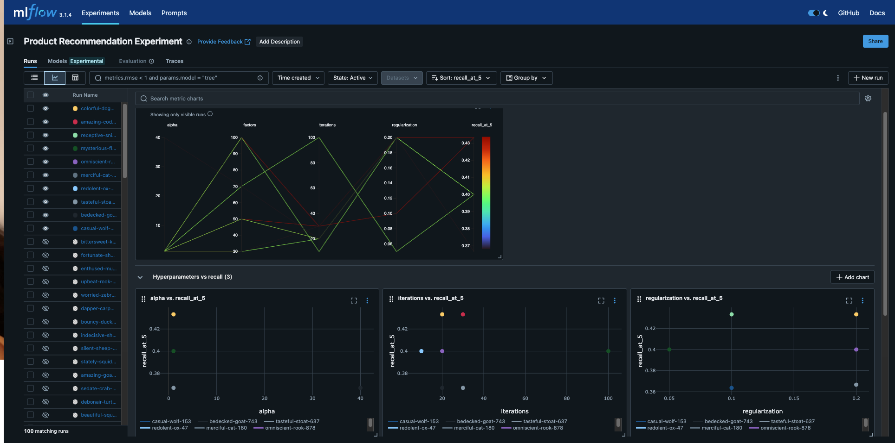
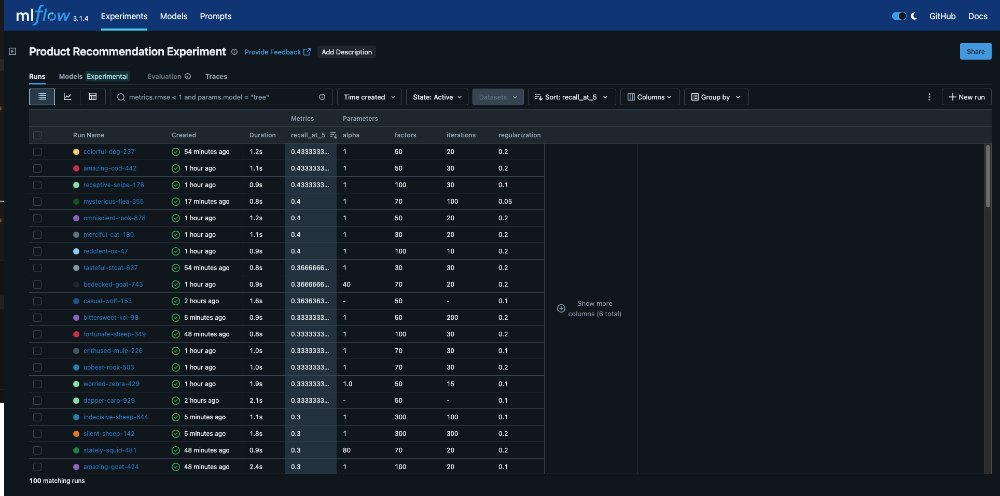

# Recommendation Pipeline with Ray, ALS, and MLflow

This project implements an end-to-end product recommendation system for an e-commerce platform. It captures real-time user interactions, processes them through offline training jobs, and serves updated recommendations to the frontend.




## **Details**

* **Algorithm**: Alternating Least Squares (ALS) – a matrix factorization technique used for collaborative filtering. ALS works by alternating between fixing user factors and item factors to minimize the difference between predicted and actual user-item interactions.
* **Metric**: `recall_at_5` – measures the fraction of relevant items successfully retrieved in the top 5 recommendations for each user. A higher value indicates that users are more likely to see products they truly care about.
* **Distributed Training**: Ray remote jobs
* **Experiment Tracking**: MLflow (runs tracked under `mlruns`)


* MLflow UI is accessible at [http://localhost:5001](http://localhost:5001).
* Experiment data is persisted in a named Docker volume and optionally a local SQLite file (`mlflow.db`).

## **Getting Started**

1. Clone this repository.
2. Build and start:

```bash
docker-compose up --build -d
```
3. Clone API branch and build and start the same way.
4. Interact with the frontend to create date recommendations will be served from Redis.
5. Train models by running the Ray offline job script.
6. Monitor experiment results in the MLflow UI.