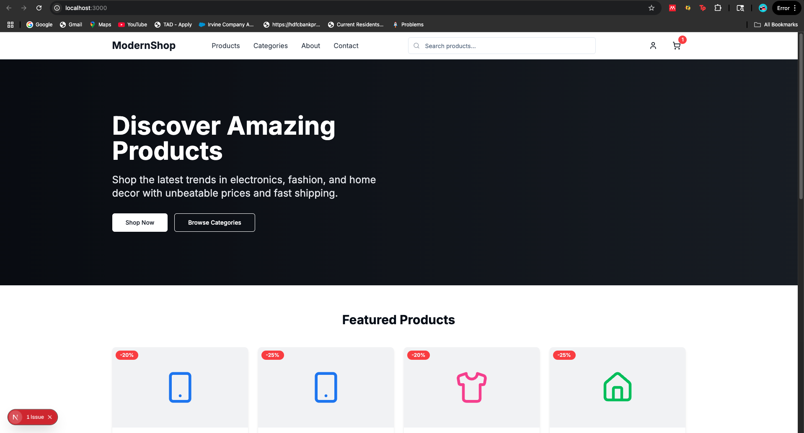

## E-commerce Website

Frontend to be used for making requests to Go API for tracking events and getting recommendations.




Getting Started
Clone the repository and install dependencies:

```bash

npm install

npm run dev
```

Open http://localhost:3000 to view the app in your browser.